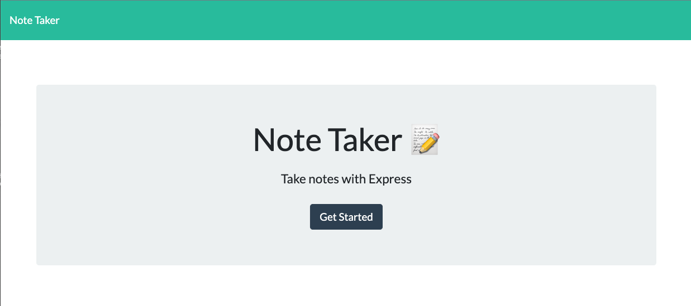
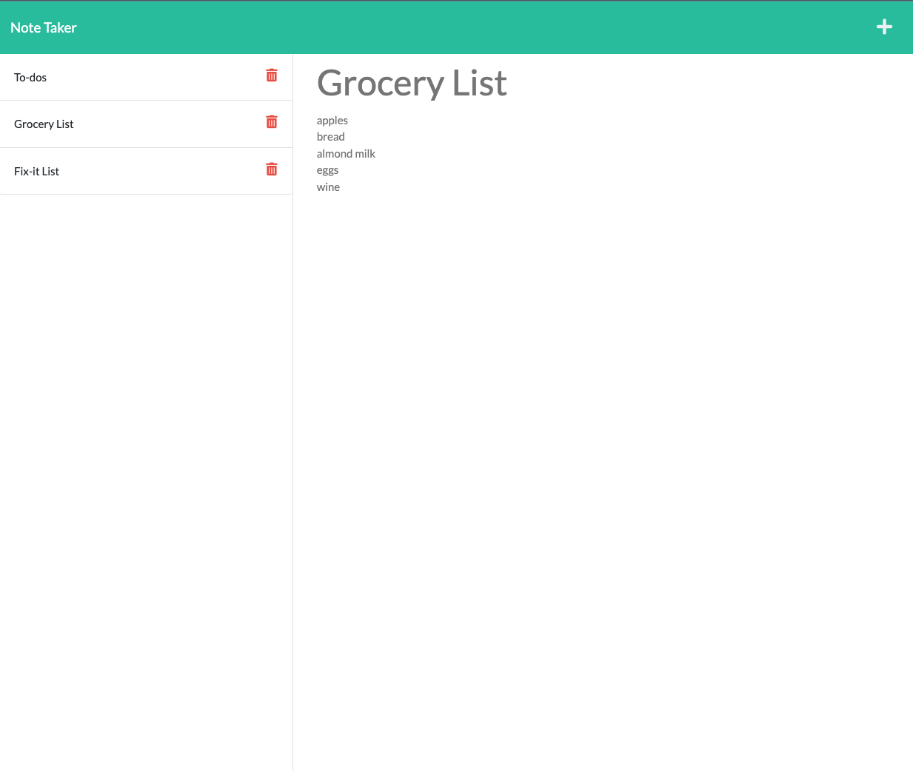

# Note-Taker-App

  ## Table of Contents
  - [Description](#description)
  - [Installation](#installation)
  - [Useage](#useage)
  - [Testing](#testing)
  - [Collaborators](#collaborators)
  - [Questions](#questions)

  ## Description 
  This application called Note Taker can be used to write and save notes. This app uses an Express.js back end and saves and retrieves note data from a JSON file. 

  ## Installation
  Installation of [Express](https://expressjs.com/)
  *  Use ``node i`` to install

  ## Useage 
  This application run by using the following command: ``node server.js`` or ``npm start``. Click 'Get Started' on the home page and enter a 'Note Title' & 'Note Text' click the save icon and your notes will be generated on the left side. To delete a note, simply click on the trash icon.
  
  View the application deployed to Heroku [here](https://boiling-earth-31469.herokuapp.com/).

  ## Testing 
  n/a

  ## Collaborators 
  n/a

  ## Questions?

  GitHub: [@RachelWildberger](https://github.com/RachelWildberger)

  Email: rachelwildberger@icloud.com